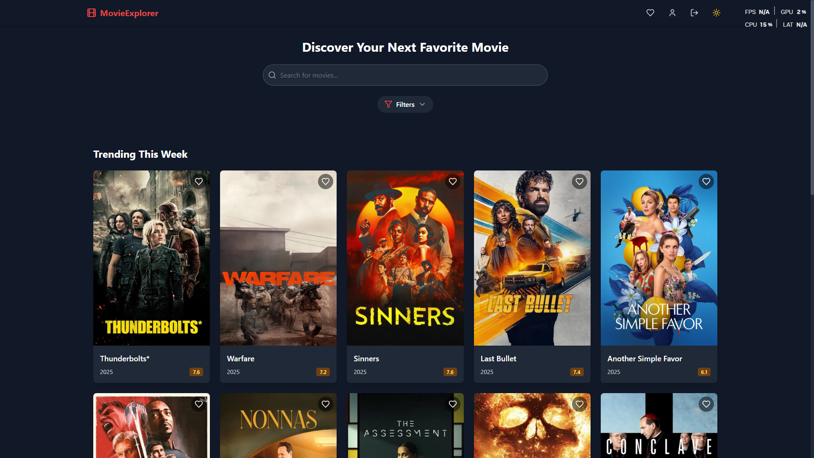
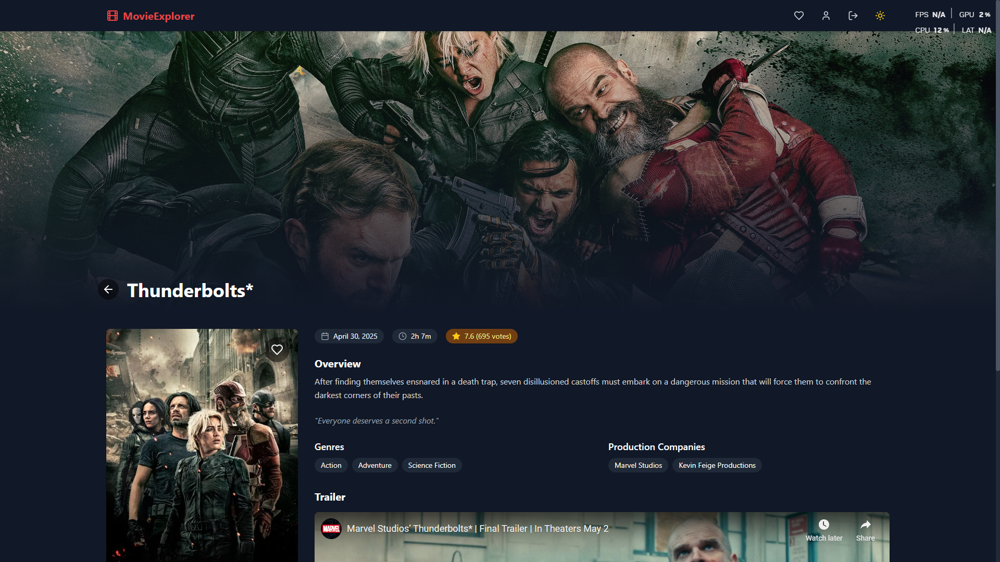

# Movie Explorer

A modern web application for discovering, searching, and saving your favorite movies.

<div style="display: flex; gap: 10px;">
   
   
</div>

## Features

- **User Authentication**: Login and register functionality with local storage persistence
- **Movie Discovery**: Browse trending movies and search for specific titles
- **Detailed Movie View**: View comprehensive information about each movie including trailers
- **Favorites Management**: Save and manage your favorite movies
- **Theme Switching**: Toggle between light and dark mode
- **Responsive Design**: Optimized for mobile, tablet, and desktop views
- **Filter System**: Filter movies by genre, year, and rating

## Tech Stack

- React with TypeScript
- Tailwind CSS for styling
- React Router for navigation
- Context API for state management
- The Movie Database (TMDb) API for movie data

## Getting Started

1. Clone the repository
2. Install dependencies:
   ```
   npm install
   ```
3. Create a `.env` file in the root directory with your TMDb API key:
   ```
   VITE_TMDB_API_KEY=your_api_key_here
   VITE_TMDB_API_URL=https://api.themoviedb.org/3
   VITE_TMDB_IMAGE_URL=https://image.tmdb.org/t/p
   ```
4. Start the development server:
   ```
   npm run dev
   ```

## API Integration

This application uses The Movie Database (TMDb) API to fetch movie data. You'll need to register for a free API key at [https://www.themoviedb.org/documentation/api](https://www.themoviedb.org/documentation/api).

## Demo Credentials

For testing purposes, you can use the following credentials:
- Username: `demo`
- Password: `password`

## Live Demo

Check out the live demo of the application here: [Movie Explorer Live Demo](https://movie-explorer-ivory.vercel.app/)

## Project Structure

```
src/
├── components/    # Reusable UI components
├── contexts/      # React Context API providers
├── pages/         # Main application pages
├── services/      # API integration and services
├── types/         # TypeScript type definitions
└── utils/         # Utility functions
```

## License

All movie data is provided by The Movie Database (TMDb) API.